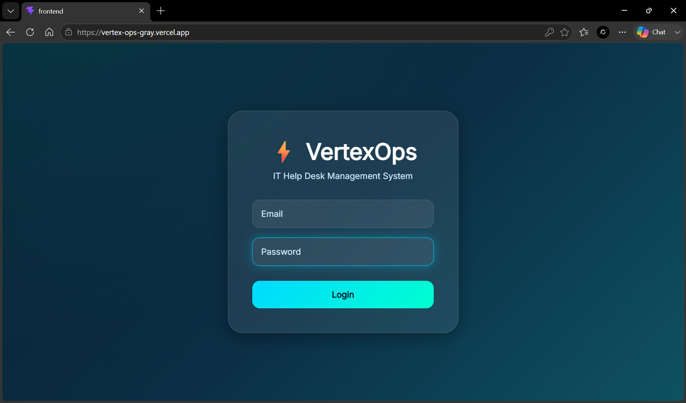
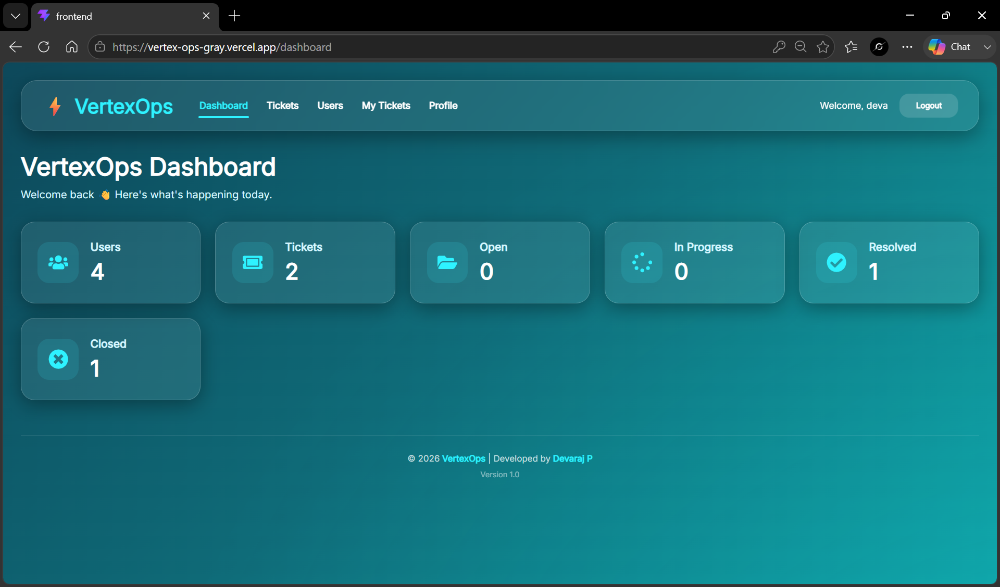
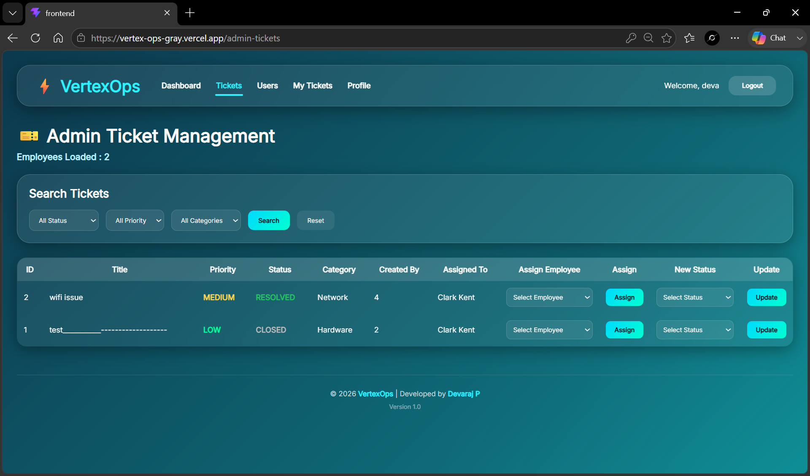
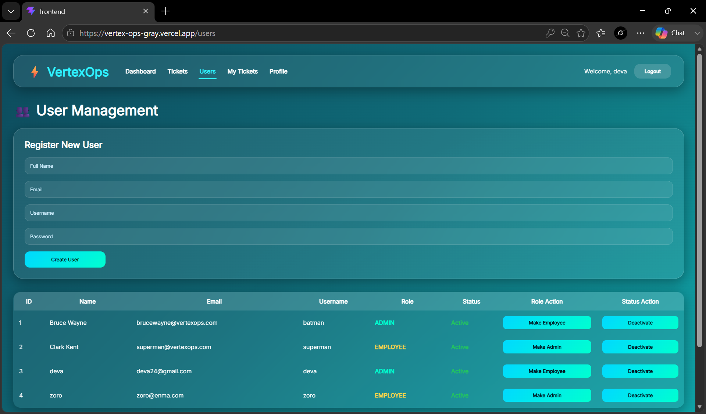
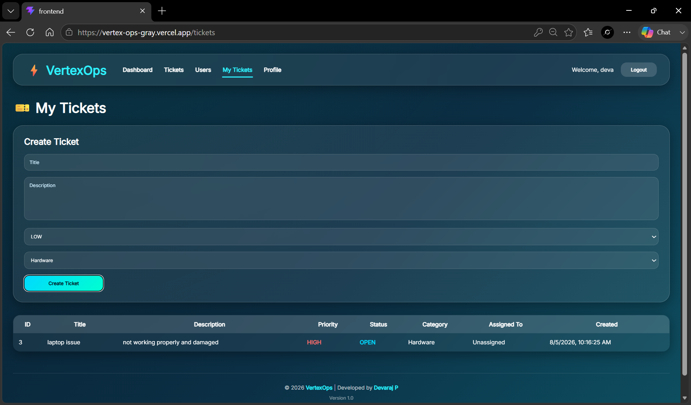
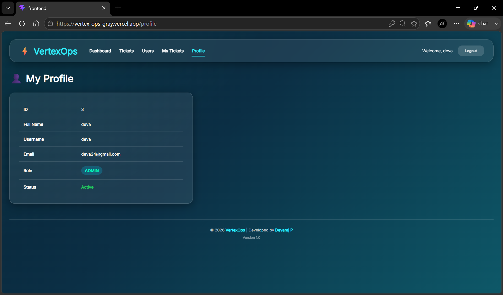
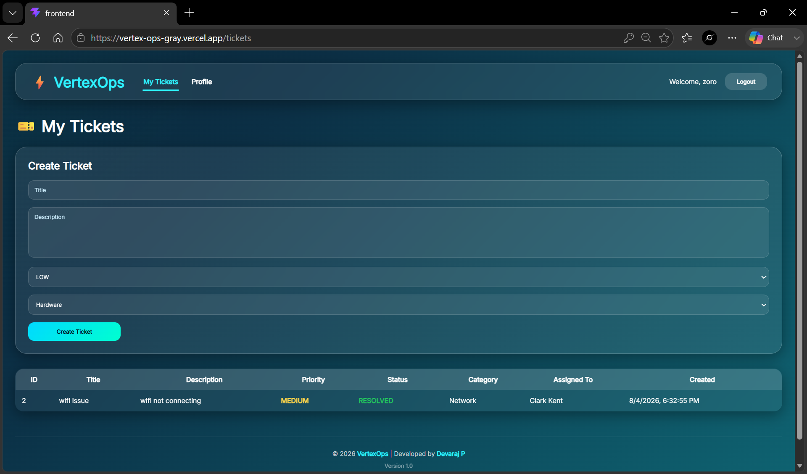
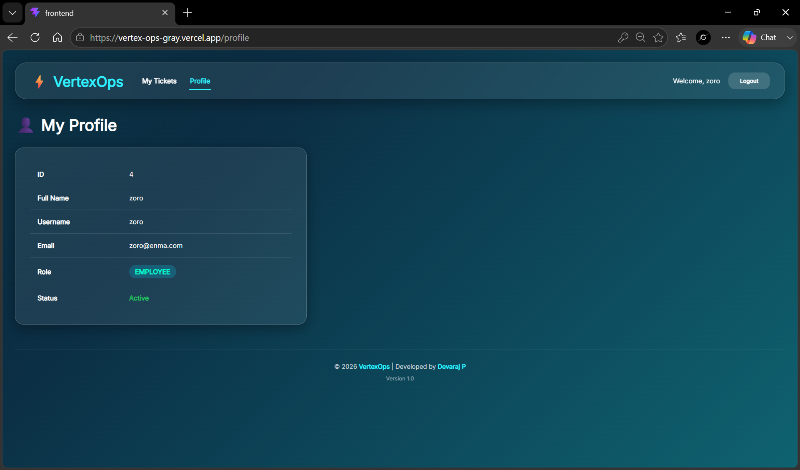

<div align="center">

# 🚀 VertexOps

### Enterprise IT Ticket Management System

A production-ready full-stack IT Help Desk application built with **React**, **FastAPI**, **SQLAlchemy**, **PostgreSQL**, and **Oracle Database**. VertexOps enables organizations to efficiently manage users, support tickets, and IT workflows through a secure role-based system.

<p>


</p>

### 🌐 Live Demo

**Frontend:** https://vertex-ops-gray.vercel.app/

**Backend API:** https://vertexops-api.onrender.com

**Swagger API:** https://vertexops-api.onrender.com/docs

</div>

---

# 📖 About The Project

VertexOps is a modern IT Ticket Management System designed to simulate how enterprise organizations manage internal technical support operations.

The application provides separate experiences for administrators and employees. Employees can create and monitor support tickets, while administrators manage users, assign tickets, update ticket statuses, and oversee the entire support workflow through a centralized dashboard.

The project was built to demonstrate modern full-stack development practices including secure authentication, RESTful API design, role-based authorization, cloud deployment, and relational database integration.

A key architectural feature of VertexOps is its ability to work with both **Oracle Database** for local enterprise development and **PostgreSQL** for cloud deployment without requiring application code changes.

---

# ✨ Features

## 🔐 Authentication & Security

- JWT Authentication
- Secure Password Hashing
- Protected API Routes
- Role-Based Authorization
- Session Management
- Environment-based Configuration

---

## 👨‍💼 Administrator Module

Administrators have complete control over the system.

### Features

- Dashboard Analytics
- Create Users
- Manage Employees
- Activate / Deactivate Accounts
- Assign User Roles
- View All Tickets
- Assign Tickets
- Update Ticket Status
- Search Tickets
- Filter Tickets
- Profile Management

---

## 👨‍🔧 Employee Module

Employees can efficiently manage their support requests.

### Features

- Secure Login
- Dashboard
- Create Support Tickets
- View Personal Tickets
- Track Ticket Progress
- Profile Management

---

## 📊 Dashboard

The dashboard provides real-time information including:

- Total Users
- Total Tickets
- Open Tickets
- In Progress Tickets
- Closed Tickets
- Resolved Tickets

---

## 🗄 Database Support

VertexOps supports two enterprise databases.

### Oracle Database

- Local Development
- Enterprise SQL Practice
- Oracle XE Support

### PostgreSQL

- Neon Cloud Database
- Production Deployment
- Cloud Ready

Database selection is handled automatically through environment configuration.

---

# 📸 Application Preview

## 🔐 Login

Secure authentication using JWT.



---

## 📊 Administrator Dashboard

Real-time dashboard displaying ticket statistics and system overview.



---

## 🎫 Ticket Management

Administrators can assign employees, update ticket status, search, and manage support requests.



---

## 👥 User Management

Create users, assign roles, activate/deactivate accounts, and manage employees.



---

## 📝 Employee Ticket Portal

Employees can create support tickets and monitor their assigned issues.



---

## 👤 Administrator Profile

Administrator account information and role management.



---

## 👨‍💼 Employee Dashboard

Dashboard tailored specifically for employee accounts.



---

## 👤 Employee Profile

Employee account information.



---

# 🏗 System Architecture

```text
                    React + Vite
                        │
                        │
                  Axios REST API
                        │
                        ▼
                 FastAPI Backend
                        │
                JWT Authentication
                        │
                 SQLAlchemy ORM
                        │
        ┌───────────────┴───────────────┐
        │                               │
 Oracle Database XE             Neon PostgreSQL
(Local Development)          (Cloud Deployment)
```

---

# 🛠 Technology Stack

## Frontend

- React 19
- Vite
- React Router
- Axios
- Framer Motion
- React Icons
- React Toastify
- CSS3

---

## Backend

- Python
- FastAPI
- SQLAlchemy
- Pydantic
- Passlib
- JWT Authentication
- Psycopg
- OracleDB Driver

---

## Database

- PostgreSQL (Neon)
- Oracle Database XE

---

## Deployment

- Vercel
- Render
- Neon PostgreSQL

---

## Development Tools

- Git
- GitHub
- VS Code
- Swagger UI

---

# 📂 Project Structure

```text
VertexOps
│
├── backend
│   ├── app
│   │   ├── api
│   │   ├── core
│   │   ├── database
│   │   ├── models
│   │   ├── schemas
│   │   ├── security
│   │   └── main.py
│   │
│   ├── requirements.txt
│   └── .env.example
│
├── frontend
│   ├── public
│   ├── src
│   │   ├── api
│   │   ├── components
│   │   ├── pages
│   │   └── assets
│   │
│   └── package.json
│
├── screenshots
│
└── README.md
```

---

# 🚀 Getting Started

## Clone the Repository

```bash
git clone https://github.com/devaraj24126-gif/VertexOps.git
cd VertexOps
```

---

## Backend Setup

```bash
cd backend

python -m venv venv

venv\Scripts\activate

pip install -r requirements.txt

uvicorn app.main:app --reload
```

---

## Frontend Setup

```bash
cd frontend

npm install

npm run dev
```

---

# 🌍 Deployment

| Service | Platform |
|----------|----------|
| Frontend | Vercel |
| Backend | Render |
| Database | Neon PostgreSQL |
| Development Database | Oracle XE |

---

# 🔑 Environment Variables

Create a `.env` file inside the backend directory.

Required variables:

```env
DATABASE_URL=

DB_HOST=
DB_PORT=
DB_SERVICE=
DB_USERNAME=
DB_PASSWORD=

SECRET_KEY=
ALGORITHM=
ACCESS_TOKEN_EXPIRE_MINUTES=
```

Example configuration is available in:

```text
backend/.env.example
```

---

# 📚 API Documentation

Interactive API documentation is available through Swagger UI.

```
/docs
```

---

# 🔒 Security

VertexOps implements several security best practices.

- JWT Authentication
- Password Hashing
- Protected Routes
- Role-Based Access Control
- Environment Variable Configuration

---

# 🎯 Skills Demonstrated

This project demonstrates practical experience with:

- Full Stack Development
- React Development
- FastAPI
- REST API Design
- SQLAlchemy ORM
- JWT Authentication
- Oracle Database
- PostgreSQL
- Cloud Deployment
- Git & GitHub
- API Integration
- Responsive UI Design

---

# 🛣 Roadmap

Future improvements planned for VertexOps include:

- File Attachments
- Email Notifications
- Ticket Comments
- Search & Advanced Filters
- Analytics Dashboard
- Docker Support
- GitHub Actions CI/CD
- Audit Logs
- AI-powered Ticket Categorization

---

# 👨‍💻 Developer

## Devaraj P

Bachelor of Computer Applications (BCA)

Aspiring Full Stack Developer passionate about building scalable web applications using modern technologies.

**GitHub**

https://github.com/devaraj24126-gif

**LinkedIn**

https://www.linkedin.com/in/deva-p-883651329/

---

<div align="center">

⭐ If you found this project useful, consider giving it a star.

Built with React • FastAPI • SQLAlchemy • Oracle • PostgreSQL

</div>
